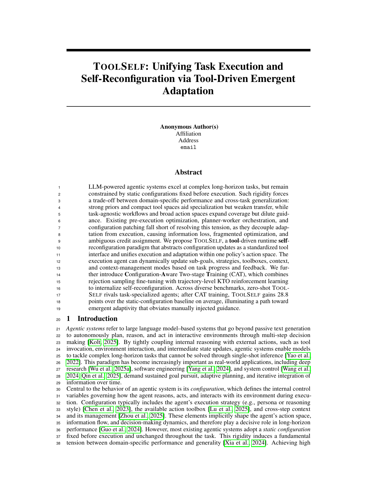

# 🛠️ ToolSelf

<p align="center">
  <b>ToolSelf: Unifying Task Execution and Configuration Generation for Tool-Use Agents</b>
</p>

<p align="center">
  <a href="#-overview">Overview</a> •
  <a href="#-installation">Installation</a> •
  <a href="#-quick-start">Quick Start</a> •
  <a href="#-reproducibility">Reproducibility</a> •
  <a href="#-citation">Citation</a>
</p>

<p align="center">
  
</p>

<p align="center">
  
  
  
  
</p>

## ✨ Overview

ToolSelf is a tool-use agent framework that unifies **task execution** and **configuration generation** in one iterative loop.

At each stage, ToolSelf maintains:

- 🎯 a current sub-goal,
- 🧰 a stage-specific toolbox,
- 🧠 inter-stage knowledge,
- 🗺️ an execution strategy,
- 📚 a context-management mode.

The execution agent focuses on the current sub-goal, while the configuration-generation step decides what should happen next. This makes ToolSelf a practical framework for long-horizon, tool-heavy tasks where the agent must repeatedly adapt its plan, tools, and context.

This repository contains:

- the ToolSelf implementation,
- web/search/file/code tools,
- GAIA-style evaluation runners,
- loaders for GAIA, GAIA(WS), FRAMES, and XBench DeepSearch-2510,
- reproducibility configs and helper scripts.

> Datasets, API keys, private model endpoints, and run outputs are intentionally not included.

## 🧩 Method At A Glance

```text
Main Task Q
    |
    v
Configuration Generation
    |-- sub-goal
    |-- execution strategy
    |-- toolbox
    |-- inter-stage knowledge
    `-- context-management mode
    |
    v
Execution Agent + Tools
    |
    v
History / Result / Reconfiguration Signal
    |
    `-------- repeat until termination
```

## 📁 Repository Structure

```text
.
├── config.py                         # Environment-driven model/tool config
├── toolself_gaia.py                  # ToolSelf benchmark runner
├── execution_agent/                  # ReAct-style execution agent
├── tools/                            # Tool implementations
├── run_GAIA/
│   ├── evaluator.py                  # GAIA-style evaluator
│   ├── run_eval.py                   # Direct evaluation entry point
│   ├── run_eval_isolated.py          # Per-sample isolated runner
│   └── configs/                      # Dataset config templates
├── scripts/
│   ├── run_eval.sh                   # Convenience runner
│   └── summarize_results.py          # Result summary utility
├── docs/
│   ├── datasets.md
│   └── reproducibility.md
├── requirements.txt
└── .env.example
```

## ⚙️ Installation

```bash
python -m venv .venv
source .venv/bin/activate
pip install -r requirements.txt
```

Create a local environment file:

```bash
cp .env.example .env
source .env
```

Required environment variables:

| Variable | Purpose |
|---|---|
| `MAIN_LLM_API_KEY` | API key for the main ToolSelf agent |
| `MAIN_LLM_API_BASE_URL` | OpenAI-compatible API base URL |
| `MAIN_LLM_MODEL` | Main model name |
| `JUDGE_API_KEY` | API key for the LLM-as-judge |
| `JUDGE_BASE_URL` | Judge API base URL |
| `JUDGE_MODEL` | Judge model name |
| `SEARX_HOST` | Searx search endpoint |
| `DATA_ROOT` | Root directory for local benchmark files |

Optional variables:

| Variable | Purpose |
|---|---|
| `JINA_KEY` | Jina Reader API key |
| `JINA_READER_URL` | Jina Reader endpoint |
| `VISIT_LLM_*` | Separate webpage-summary model config |
| `FILE_ANALYZER_*` | Separate file-analysis model config |
| `MAX_LLM_CALL_PER_RUN` | Per-run LLM call budget |

## 🚀 Quick Start

Run a small smoke test:

```bash
scripts/run_eval.sh \
  --config run_GAIA/configs/gaia.example.json \
  --max-samples 2 \
  --max-parallel-workers 1 \
  --sample-timeout-seconds 600
```

Summarize a completed run:

```bash
python scripts/summarize_results.py outputs/gaia
```

## 🗂️ Data Preparation

The repository provides loaders and config templates, but not benchmark data.

Default expected layout:

```text
${DATA_ROOT}/GAIA.json
${DATA_ROOT}/GAIA(WS).json
${DATA_ROOT}/FRAMES/frames_subset_200.json
${DATA_ROOT}/DeepSearch-2510.csv
```

GAIA-style JSON entries should contain:

| Field | Description |
|---|---|
| `task_id` | Unique task identifier |
| `question` | User task/question |
| `final_answer` | Reference answer |
| `level` | Optional difficulty or dataset level |

DeepSearch-2510 is loaded from the XBench CSV format. The loader decodes `prompt`, `answer`, and optional `reference_steps` with the row-level `canary` field and maps each row to the GAIA-style schema.

More details: [`docs/datasets.md`](docs/datasets.md).

## 🧪 Reproducibility

Use the isolated runner for full benchmark runs. It launches each sample in a child process, so a hung tool call or network request does not block the entire job.

### GAIA

```bash
scripts/run_eval.sh \
  --config run_GAIA/configs/gaia.example.json \
  --max-parallel-workers 4 \
  --sample-timeout-seconds 1800
```

### GAIA(WS)

```bash
scripts/run_eval.sh \
  --config run_GAIA/configs/gaia_ws.example.json \
  --max-parallel-workers 4 \
  --sample-timeout-seconds 1800
```

### FRAMES

```bash
scripts/run_eval.sh \
  --config run_GAIA/configs/frames.example.json \
  --max-parallel-workers 4 \
  --sample-timeout-seconds 1800
```

### XBench DeepSearch-2510

```bash
scripts/run_eval.sh \
  --config run_GAIA/configs/deepsearch.example.json \
  --max-parallel-workers 4 \
  --sample-timeout-seconds 1800
```

More details: [`docs/reproducibility.md`](docs/reproducibility.md).

## 📦 Outputs

Each run writes an output directory with:

```text
results/task_<task_id>_result.json
results/summary.json
logs/
workspaces/
isolated_runs/
```

Do not commit `.env`, datasets, output directories, workspaces, logs, or isolated run artifacts.

## 🔒 Release Hygiene

Before publishing or pushing updates:

```bash
rg -n "api_key|secret|token|password|PRIVATE_ENDPOINT|ABSOLUTE_LOCAL_PATH" .
find . -type d -name "__pycache__" -prune -exec rm -rf {} +
```

## 📌 Citation

```bibtex
@article{toolself2026,
  title={ToolSelf: Unifying Task Execution and Configuration Generation for Tool-Use Agents},
  author={Anonymous Authors},
  year={2026}
}
```

Replace the BibTeX entry with the final citation metadata after publication.

## 📄 License

This project is released under the MIT License. See [`LICENSE`](LICENSE).
