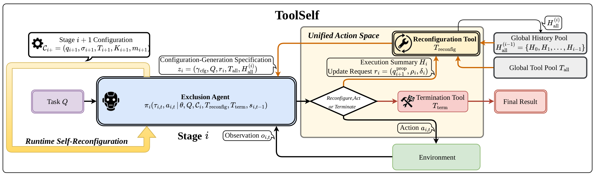

<div align="center">

# [ToolSelf: Unifying Task Execution and Self-Reconfiguration via Tool-Driven Emergent Adaptation](https://arxiv.org/abs/2602.07883)

</div>

<div align="center">
  <a href="https://arxiv.org/abs/2602.07883"></a>
  <a href="https://github.com/lian-tian-mo-zun/ToolSelf"></a>
  <a href="https://opensource.org/licenses/MIT"></a>
  
  
  
</div>

## 🚀 News

- **[6/15/2026]** We release the ToolSelf codebase, evaluation runners, reproducibility configs, and documentation.
- **[5/31/2026]** ToolSelf v3 is available on arXiv: [arXiv:2602.07883](https://arxiv.org/abs/2602.07883).

## 💡 Introduction

We introduce **TOOLSELF**, a tool-driven runtime self-reconfiguration paradigm for long-horizon tool-use agents. Existing agentic systems often rely on configurations fixed before execution, including sub-goals, strategies, toolboxes, context, and context-management modes. This static design creates a tension between specialization and generalization: narrow configurations provide strong task guidance but transfer poorly, while broad task-agnostic configurations cover more tasks but dilute useful priors and enlarge the action space.

ToolSelf resolves this tension by treating configuration updates as a standardized tool interface. The execution agent can invoke a reconfiguration tool during task solving, summarize the current stage, and generate the next configuration based on task progress and feedback. In this way, task execution and adaptation are unified within one policy's action space rather than split across external optimizers, planners, or patching modules.

<div align="center">

</div>
<small><em>Overview of ToolSelf. Configuration becomes a dynamic, tool-updatable variable, enabling a single execution policy to jointly perform task solving and runtime self-reconfiguration.</em></small>

### 🔧 Method Overview

ToolSelf equips the execution agent with two special tools in addition to ordinary environment tools:

- **Reconfiguration Tool**: updates sub-goals, execution strategies, toolboxes, task knowledge, and context-management modes.
- **Termination Tool**: returns the final answer when the task is complete.

At stage `i`, the agent operates under a configuration `C_i = (q_i, sigma_i, T_i, K_i, m_i)`, where `q_i` is the current sub-goal, `sigma_i` is the execution strategy, `T_i` is the stage-specific toolbox, `K_i` is task knowledge, and `m_i` is the context-management mode. When the current configuration no longer matches task progress, the agent invokes the reconfiguration tool to produce `C_{i+1}` and continue execution.

### 🧠 Configuration-Aware Two-stage Training

We further introduce **Configuration-Aware Two-stage Training (CAT)** to internalize self-reconfiguration:

- **Stage I: Rejection Sampling Fine-Tuning (RFT)** uses successful teacher-generated trajectories for cold-start initialization.
- **Stage II: Trajectory-level KTO Reinforcement Learning** optimizes reconfiguration decisions using task-level success or failure feedback.

This design aligns training with the nature of self-reconfiguration: the quality of a configuration update is only revealed through downstream task completion.

## 📊 Performance

ToolSelf is evaluated across deep research, general AI assistance, and software engineering benchmarks.

### 🌐 Strong Cross-task Generalization

Zero-shot ToolSelf rivals task-specialized agents while preserving broad task coverage. By updating its own configuration during execution, ToolSelf avoids relying on manually injected task-specific workflows.

### 🏆 Training Improves Runtime Adaptation

After CAT training, ToolSelf gains **28.8 points** over the static-configuration baseline on average across diverse benchmarks, showing that self-reconfiguration can emerge as a learnable capability.

### 🔁 Long-horizon Adaptivity

Case studies show that ToolSelf can elicit advanced behaviors including long-horizon planning, self-refinement, and self-correction through its execution-reconfiguration loop.

## ⚡ Quick Start

### 🛠️ Prerequisites

- Python 3.10+
- OpenAI-compatible chat-completions endpoint
- Searx endpoint for web search
- Local benchmark data for evaluation

### 📥 Installation

```bash
git clone https://github.com/lian-tian-mo-zun/ToolSelf.git
cd ToolSelf

python -m venv .venv
source .venv/bin/activate
pip install -r requirements.txt
```

### 📁 Project File Structure

```text
ToolSelf/
├── config.py                         # Environment-driven model and tool config
├── toolself_gaia.py                  # ToolSelf benchmark runner
├── execution_agent/                  # ReAct-style execution agent
├── tools/                            # Tool implementations
├── run_GAIA/
│   ├── evaluator.py                  # GAIA-style evaluator
│   ├── run_eval.py                   # Direct evaluation entry point
│   ├── run_eval_isolated.py          # Per-sample isolated runner
│   └── configs/                      # Dataset config templates
├── scripts/
│   ├── run_eval.sh                   # Convenience runner
│   └── summarize_results.py          # Result summary utility
├── docs/
│   ├── datasets.md                   # Dataset preparation notes
│   └── reproducibility.md            # Reproducibility guide
├── assets/                           # README figures
├── requirements.txt
└── .env.example
```

### ⚙️ Configuration

Copy the example environment file:

```bash
cp .env.example .env
```

Edit `.env` with your local settings, then load it:

```bash
source .env
```

#### 1️⃣ Main Agent Backend

ToolSelf uses an OpenAI-compatible chat-completions endpoint for the main execution agent:

```bash
export MAIN_LLM_API_KEY="your-api-key"
export MAIN_LLM_API_BASE_URL="https://your-endpoint/v1"
export MAIN_LLM_MODEL="your-model-name"
export MAIN_LLM_MAX_TOKENS="4096"
```

#### 2️⃣ Judge Backend

Evaluation uses an LLM-as-judge endpoint:

```bash
export JUDGE_API_KEY="your-judge-api-key"
export JUDGE_BASE_URL="https://your-judge-endpoint/v1"
export JUDGE_MODEL="your-judge-model"
```

#### 3️⃣ Web and File Tools

Configure search and optional webpage/file-analysis models:

```bash
export SEARX_HOST="http://localhost:8888"
export SEARX_LANGUAGE="en-US"
export JINA_KEY="your-jina-key"
export JINA_READER_URL="https://r.jina.ai/"
```

Optional model groups:

```bash
export VISIT_LLM_API_KEY="${MAIN_LLM_API_KEY}"
export VISIT_LLM_API_BASE_URL="${MAIN_LLM_API_BASE_URL}"
export VISIT_LLM_MODEL="${MAIN_LLM_MODEL}"

export FILE_ANALYZER_API_KEY="${MAIN_LLM_API_KEY}"
export FILE_ANALYZER_API_BASE_URL="${MAIN_LLM_API_BASE_URL}"
export FILE_ANALYZER_TEXT_MODEL="your-text-model"
export FILE_ANALYZER_VISION_MODEL="your-vision-model"
```

#### 4️⃣ Runtime Limits

```bash
export MAX_LLM_CALL_PER_RUN="200"
```

### 🧪 Running a Smoke Test

```bash
scripts/run_eval.sh \
  --config run_GAIA/configs/gaia.example.json \
  --max-samples 2 \
  --max-parallel-workers 1 \
  --sample-timeout-seconds 600
```

Summarize a completed run:

```bash
python scripts/summarize_results.py outputs/gaia
```

## 🗂️ Dataset Preparation

This repository provides loaders and config templates, but does not redistribute benchmark data.

Set `DATA_ROOT` to your local benchmark directory:

```bash
export DATA_ROOT="/path/to/datasets"
```

Default expected layout:

```text
${DATA_ROOT}/GAIA.json
${DATA_ROOT}/GAIA(WS).json
${DATA_ROOT}/FRAMES/frames_subset_200.json
${DATA_ROOT}/DeepSearch-2510.csv
```

GAIA-style JSON entries should contain:

| Field | Description |
|---|---|
| `task_id` | Unique task identifier |
| `question` | User task/question |
| `final_answer` | Reference answer |
| `level` | Optional difficulty or dataset level |

DeepSearch-2510 is loaded from the XBench CSV format. The loader decodes `prompt`, `answer`, and optional `reference_steps` with the row-level `canary` field and maps each row to the GAIA-style schema.

More details are available in [`docs/datasets.md`](docs/datasets.md).

## 🔬 Reproducibility

Use the isolated runner for full benchmark runs. It launches each sample in a child process, so a hung tool call or network request does not block the entire job.

### GAIA

```bash
scripts/run_eval.sh \
  --config run_GAIA/configs/gaia.example.json \
  --max-parallel-workers 4 \
  --sample-timeout-seconds 1800
```

### GAIA(WS)

```bash
scripts/run_eval.sh \
  --config run_GAIA/configs/gaia_ws.example.json \
  --max-parallel-workers 4 \
  --sample-timeout-seconds 1800
```

### FRAMES

```bash
scripts/run_eval.sh \
  --config run_GAIA/configs/frames.example.json \
  --max-parallel-workers 4 \
  --sample-timeout-seconds 1800
```

### XBench DeepSearch-2510

```bash
scripts/run_eval.sh \
  --config run_GAIA/configs/deepsearch.example.json \
  --max-parallel-workers 4 \
  --sample-timeout-seconds 1800
```

More details are available in [`docs/reproducibility.md`](docs/reproducibility.md).

## 📦 Outputs

Each evaluation run writes an output directory containing:

```text
results/task_<task_id>_result.json
results/summary.json
logs/
workspaces/
isolated_runs/
```

Do not commit `.env`, datasets, output directories, workspaces, logs, or isolated run artifacts.

## 📌 Citation

```bibtex
@article{zhou2026toolself,
  title={ToolSelf: Unifying Task Execution and Self-Reconfiguration via Tool-Driven Emergent Adaptation},
  author={Zhou, Jingqi and Wang, Sheng and Deng, Dezhao and Lu, Junwen and Su, Junwei and Li, Qintong and Gao, Jiahui and Wu, Hao and Jiang, Jiyue and Kong, Lingpeng and Jin, Dunhong and Wu, Chuan},
  journal={arXiv preprint arXiv:2602.07883},
  year={2026}
}
```

## 📄 License

This project is released under the MIT License. See [`LICENSE`](LICENSE).
